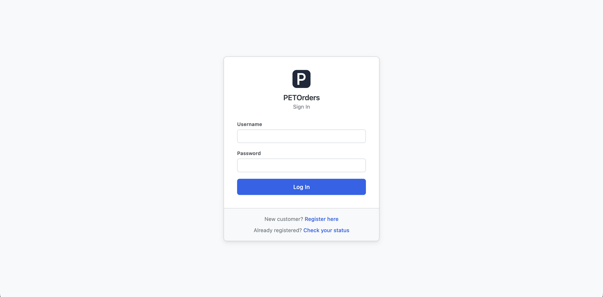

# PETOrders — Production Deployment Guide (RHEL 8)

**Audience:** IT staff deploying PETOrders for the first time. This guide
assumes you know your way around RHEL, Apache, and MariaDB generally, but
know nothing about this application. Follow the steps in order.

**What you are deploying:** a self-contained PHP 7.4 web application with a
MariaDB database. There is no build step, no package manager, no external
services, and no outbound network dependency of any kind — the app never
sends email and loads no assets from CDNs. Deployment is: install
prerequisites, put the files on disk, create the database, fill in one
config file, point Apache at the right folder, and create the first admin
account.

---

## Contents

1. [Prerequisites](#1-prerequisites)
2. [Get the code](#2-get-the-code)
3. [Create the database](#3-create-the-database)
4. [Configure the app (src/config.php)](#4-configure-the-app-srcconfigphp)
5. [Configure Apache — document root must be public/](#5-configure-apache--document-root-must-be-public)
6. [HTTPS](#6-https)
7. [Create the first admin account](#7-create-the-first-admin-account)
8. [Verification checklist](#8-verification-checklist)
9. [Operational notes](#9-operational-notes)

---

## 1. Prerequisites

Target platform:

| Component | Version |
|---|---|
| OS | RHEL 8 |
| Web server | Apache (httpd) with `mod_ssl` |
| PHP | 7.4, with the `pdo_mysql` extension |
| Database | MariaDB 10.11 (MySQL 8.0 also works — the app talks standard SQL over PDO) |

Install on RHEL 8:

```bash
# Apache + SSL
sudo dnf install -y httpd mod_ssl

# PHP 7.4 (module stream) with the extensions the app uses
sudo dnf module enable -y php:7.4
sudo dnf install -y php php-mysqlnd php-json

# MariaDB 10.11 (module stream availability varies by RHEL 8 minor
# release — if 10.11 is not offered, use the stream your IT group
# supports; the app requires nothing newer than InnoDB + utf8mb4)
sudo dnf install -y mariadb-server

sudo systemctl enable --now httpd mariadb
```

Verify versions before continuing:

```bash
php -v          # expect PHP 7.4.x
php -m | grep -i pdo_mysql   # must print pdo_mysql
mysql --version # expect MariaDB 10.x
```

If this server is a fresh MariaDB install, run the standard hardening
script once:

```bash
sudo mysql_secure_installation
```

---

## 2. Get the code

Put the application anywhere **outside** an existing web root. The
conventional location used in the rest of this guide is
`/var/www/petorders`.

```bash
sudo git clone <your-git-remote>/petorders.git /var/www/petorders
```

(If you received the app as a file archive instead of a git remote, extract
it so that `/var/www/petorders` contains `public/`, `src/`, `sql/`,
`tools/`, and `config/` directly.)

Set ownership and permissions. The `apache` user only needs to **read** the
application — nothing in the app writes to disk except PHP's own session
storage and the error log, which live outside the project:

```bash
sudo chown -R root:apache /var/www/petorders
sudo find /var/www/petorders -type d -exec chmod 750 {} \;
sudo find /var/www/petorders -type f -exec chmod 640 {} \;
```

The project layout, so you know what you are looking at:

```
/var/www/petorders/
  public/    # the ONLY folder Apache will serve (see step 5)
  src/       # PHP application code + config.php (DB credentials)
  config/    # static app settings (display name)
  sql/       # schema.sql (required), seed.sql (dev/test data — NOT for production)
  tools/     # command-line setup scripts
```

---

## 3. Create the database

Create the database and a dedicated, least-privilege database user. Do
**not** run the app as the MariaDB `root` user.

```bash
sudo mysql
```

```sql
CREATE DATABASE petorders CHARACTER SET utf8mb4 COLLATE utf8mb4_unicode_ci;

CREATE USER 'petorders_app'@'localhost' IDENTIFIED BY 'CHOOSE_A_STRONG_PASSWORD';
GRANT SELECT, INSERT, UPDATE, DELETE ON petorders.* TO 'petorders_app'@'localhost';
FLUSH PRIVILEGES;
EXIT;
```

Load the schema:

```bash
sudo mysql petorders < /var/www/petorders/sql/schema.sql
```

> **Do not load `sql/seed.sql` in production.** It contains fictional
> dev/test data (sample labs, sample accounts, sample orders) and exists
> only for local development. A production database should contain the
> schema and nothing else until step 7 creates the first real admin.

---

## 4. Configure the app (src/config.php)

The app reads its settings from `src/config.php`, which is **not** in the
repository (it is gitignored so credentials never end up in git). Create it
from the committed template:

```bash
cd /var/www/petorders
sudo cp src/config.sample.php src/config.php
sudo chown root:apache src/config.php
sudo chmod 640 src/config.php
sudo vi src/config.php
```

Set every constant:

| Constant | Production value | Notes |
|---|---|---|
| `DB_HOST` | `127.0.0.1` | Local MariaDB. |
| `DB_PORT` | `3306` | MariaDB default. |
| `DB_NAME` | `petorders` | The database you created in step 3. |
| `DB_USER` | `petorders_app` | The dedicated user from step 3, never `root`. |
| `DB_PASS` | *(the password from step 3)* | |
| `REQUIRE_SECURE_COOKIES` | `true` | **Must be `true` in production.** Marks session cookies HTTPS-only. Requires working HTTPS (step 6) — with this set to `true`, login will not work over plain HTTP. |

One more file, usually left alone: `config/app_settings.php` holds static
app-wide settings (currently just the display name, `PETOrders`). It is a
plain PHP file edited directly — there is no admin UI for it. You do not
need to touch it for a normal deployment.

---

## 5. Configure Apache — document root must be public/

This is the single most important step to get right.

**Apache's `DocumentRoot` must point at `/var/www/petorders/public` —
not at `/var/www/petorders`.**

Why: `public/` is the only folder designed to be reachable by URL. The
application code (`src/`, including `config.php` with your database
credentials), the SQL files (`sql/`), the admin bootstrap script
(`tools/`), and the settings file (`config/`) all live **outside** the
document root. That means Apache cannot serve them under any URL, no
matter what a request looks like — the protection is structural, which is
strictly stronger than any deny rule. If you point the document root at
the project root instead, all of those folders become downloadable and the
database credentials are one URL away.

For the same reason, the app's only `.htaccess` file lives at
`public/.htaccess` (it blocks dotfiles, disables directory listings, turns
off the server signature, and wires the 404 page). It must stay inside
`public/` — a `.htaccess` at the project root would do nothing, because
Apache never serves that directory.

Create the vhost:

```bash
sudo vi /etc/httpd/conf.d/petorders.conf
```

```apache
<VirtualHost *:443>
    ServerName petorders.example.nih.gov
    DocumentRoot /var/www/petorders/public

    SSLEngine on
    SSLCertificateFile      /etc/pki/tls/certs/petorders.crt
    SSLCertificateKeyFile   /etc/pki/tls/private/petorders.key
    # If IT provides an intermediate/chain file:
    # SSLCertificateChainFile /etc/pki/tls/certs/petorders-chain.crt

    <Directory /var/www/petorders/public>
        # FileInfo is enough for public/.htaccess (ErrorDocument);
        # AllowOverride All also works if that is your site standard.
        AllowOverride FileInfo Options
        Require all granted
    </Directory>
</VirtualHost>

# Redirect plain HTTP to HTTPS
<VirtualHost *:80>
    ServerName petorders.example.nih.gov
    Redirect permanent / https://petorders.example.nih.gov/
</VirtualHost>
```

Replace `petorders.example.nih.gov` and the certificate paths with your
real values (step 6). Then:

```bash
sudo apachectl configtest        # expect: Syntax OK
sudo systemctl restart httpd
```

If SELinux is enforcing (RHEL default), make sure the content is labeled
for httpd:

```bash
sudo semanage fcontext -a -t httpd_sys_content_t "/var/www/petorders(/.*)?"
sudo restorecon -R /var/www/petorders
```

Open the firewall if needed:

```bash
sudo firewall-cmd --permanent --add-service=https
sudo firewall-cmd --reload
```

---

## 6. HTTPS

Production runs HTTPS-only with a **real certificate provided by IT** for
the server's hostname. Self-signed certificates are for local development
machines only — do not use one in production.

1. Request a certificate for the server's DNS name through your normal IT
   process.
2. Install the certificate and key where the vhost in step 5 expects them
   (`/etc/pki/tls/certs/`, `/etc/pki/tls/private/`), with the key readable
   only by root (`chmod 600`).
3. Keep the HTTP→HTTPS redirect vhost from step 5 in place so nobody can
   use the app over plain HTTP.

This is what makes `REQUIRE_SECURE_COOKIES = true` (step 4) work: session
cookies are flagged HTTPS-only, so they are never transmitted in clear
text. The two settings go together — real cert, then `true`.

---

## 7. Create the first admin account

The application has no default accounts and no public way to create an
admin. The first (and only) admin is created from the command line with a
one-time bootstrap script:

```bash
cd /var/www/petorders
php tools/bootstrap_admin.php jane.smith@nih.gov Jane Smith
```

The arguments are `<username> <first_name> <last_name>`. The username must
be a valid **@nih.gov** email address — it is what the admin will type to
log in.

What the script does:

- Creates exactly **one** account, with both staff and admin privileges.
- Prints a randomly generated **temporary password** to the terminal:

  ```
  Admin account created.
  Username: jane.smith@nih.gov
  Temp password: Kx3nQ8rTb2mWp9Ls
  The account must change this password on first login.
  ```

- Marks the account so that the very first login forces a password change
  (minimum 12 characters, with at least one letter and one number). The
  temporary password stops working the moment a real one is set.

Relay the temporary password to the admin over NIH email — the app itself
never sends email, and the password is only ever shown in this terminal
output.

**Safety guard:** the script refuses to run if the `users` table already
has any rows, and exits with an error instead. This means it cannot
clobber a live database — it only works against a freshly created, empty
schema. If you need a second admin later, the first admin creates it from
inside the app (Accounts → + Account).

Do **not** confuse this with `tools/set_temp_passwords.php`. That script is
a development-only helper that resets *every* account to a shared temporary
password for use with the seeded dev database. Never run it in production.

Once the admin is created, they can log in and set up everything else
through the UI: approve customer registrations, create staff accounts, and
build the catalog (nuclides, products) and directory (institutes, labs,
PIs).

---

## 8. Verification checklist

Manual checks only — the app needs no test tooling. Work through these in
order after finishing steps 1–7:

**From the server:**

- [ ] `php -l /var/www/petorders/public/login.php` prints
      `No syntax errors detected`. (Repeat for `public/index.php` if you
      want a second data point — every page is plain PHP, so `php -l` is a
      valid smoke test of file integrity.)
- [ ] `sudo apachectl configtest` prints `Syntax OK`.

**From a browser:**

- [ ] `https://<hostname>/` loads and redirects to the login page (the
      root URL simply forwards to `/login.php`).

  
  *The login page as it should appear on first load — PETOrders heading, Username and Password fields, and a Log In button, served over HTTPS with no certificate warning.*

- [ ] `http://<hostname>/` (plain HTTP) redirects to HTTPS.
- [ ] `https://<hostname>/src/config.php` returns **404** — this proves
      the document root is `public/` and the application code is
      unreachable by URL. If this URL returns PHP source or a blank 200
      page, **stop**: your DocumentRoot is wrong (step 5).
- [ ] `https://<hostname>/assets/` returns 403 or 404, not a file listing
      (directory indexes are disabled by `public/.htaccess`).
- [ ] Log in with the bootstrapped admin username and temporary password.
      You are immediately taken to a **Change Password** screen — set a
      real password (12+ characters, at least one letter and one number).
- [ ] After the password change you land on the **Admin Dashboard**.
- [ ] Log out, then log back in with the new password.

If every box checks, the deployment is done.

---

## 9. Operational notes

Things worth knowing before handing the URL to users:

- **Sessions time out after 15 minutes of inactivity.** The user is
  returned to the login page on their next click. This is by design.
- **Login lockout:** 5 consecutive failed password attempts lock an
  account for 15 minutes. Deliberately, the user is *not told* they are
  locked out — they see the same "Invalid username or password." message
  throughout. Admins can see recent lockouts on the Admin Dashboard
  ("Lockouts — Past 7 Days").
- **The app never sends email.** All temporary passwords (registration
  approvals, password resets) are displayed once to the admin, who relays
  them to the user via NIH email manually.
- **Passwords:** admins can trigger a reset (which generates a new
  one-time temporary password) but can never see or choose a user's
  actual password.
- **Timezone** is pinned in code to `America/New_York`; the server's
  system timezone does not affect order timestamps.
- **Backups:** all application state lives in the one MariaDB database —
  back up the `petorders` database on your standard schedule, plus a copy
  of `src/config.php` (the only file on disk that isn't in git).
- **Logs:** PHP errors go to the system PHP/Apache error log
  (`display_errors` is off; users see a generic error page). Nothing
  application-specific to rotate.
