# PETOrders — Admin Guide

This guide is for administrators. Admins can do everything staff can
(process orders — see the [Staff Guide](USER_GUIDE_STAFF.md)), plus
everything covered here: approving registrations, managing customer and
staff accounts, maintaining the catalog (nuclides and products) and the
directory (institutes, labs, PIs), and exporting reports.

Two rules that shape almost everything below:

- **Nothing is ever deleted.** Nuclides, products, institutes, labs,
  PIs, delivery locations, and accounts are *deactivated*, which only
  affects what can be chosen going forward. History is never touched.
- **PETOrders never sends email.** Every temporary password the system
  generates is shown to you exactly once, on screen — you relay it to
  the person via NIH email yourself.

## Contents

1. [Your dashboard](#1-your-dashboard)
2. [Reviewing registration requests](#2-reviewing-registration-requests)
3. [Managing customers](#3-managing-customers)
4. [Managing staff and admin accounts](#4-managing-staff-and-admin-accounts)
5. [Catalog: nuclides](#5-catalog-nuclides)
6. [Catalog: products](#6-catalog-products)
7. [Directory: institutes, labs, and PIs](#7-directory-institutes-labs-and-pis)
8. [Reports and CSV export](#8-reports-and-csv-export)

---

## 1. Your dashboard

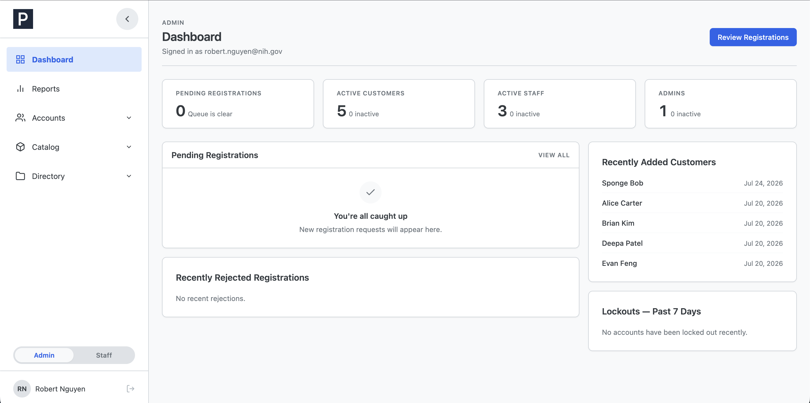
*The admin dashboard: pending registrations front and center, plus account counts and recent activity.*

- **Stat tiles** — Pending Registrations, Active Customers, Active
  Staff, and Admins (each also shows its inactive count). Click a tile
  to jump to the matching list.
- **Pending Registrations** — the review queue's newest entries, with a
  **Review** link into the full page.
- **Recently Rejected Registrations** — recent rejections with the
  reason, for quick reference when someone follows up.
- **Recently Added Customers** — the newest customer accounts.
- **Lockouts — Past 7 Days** — accounts that recently hit the failed-
  login lockout (5 wrong passwords locks an account for 15 minutes).
  Useful when someone reports they "can't log in": if they're on this
  list, they can simply wait out the 15 minutes — or you can reset
  their password, which also clears the lockout.

## 2. Reviewing registration requests

New customers request access themselves via the public registration
form. Requests land in **Registrations**, and no account exists until
you approve one.

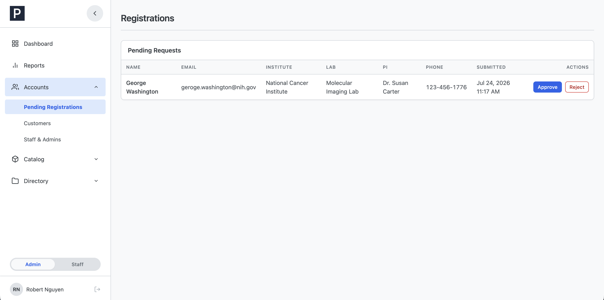
*Each pending request shows the applicant's details and their chosen institute, lab, and PI.*

Each row shows the applicant's name, email, institute, lab, PI, phone,
and submission date. A **"Previously rejected"** badge flags applicants
who have been rejected before (hover it to see the last rejection
reason).

**To approve:** click **Approve** and confirm. In one step, this creates
the customer's account (their email becomes their username) and
generates a **temporary password**, shown in a banner:

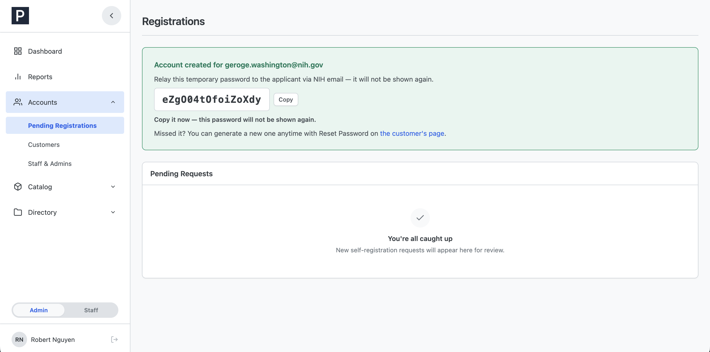
*The temporary password appears exactly once. Copy it before leaving the page.*

**Copy the password immediately** (there's a Copy button) and send it to
the applicant via NIH email. It is never shown again — if you miss it,
open the customer's page and use **Reset Password** to generate a new
one. The customer must change this password the first time they log in.

**To reject:** click **Reject**, enter a **reason** (required), and
click **Reject request**.

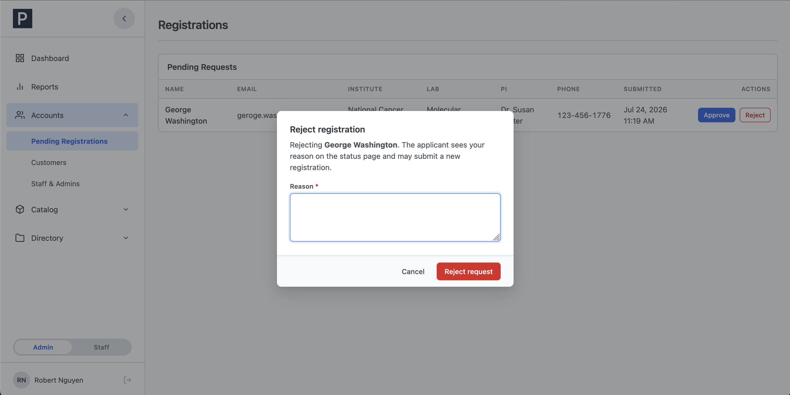
*Rejecting requires a reason.*

The reason is kept on record for admins (the dashboard's Recently
Rejected panel, and the "Previously rejected" badge on any resubmission).
The applicant's status page tells them only that their request was not
approved and to contact an administrator — so be prepared to explain the
reason if they get in touch. Rejected applicants can submit a new
registration.

## 3. Managing customers

**Customers** lists every customer account.

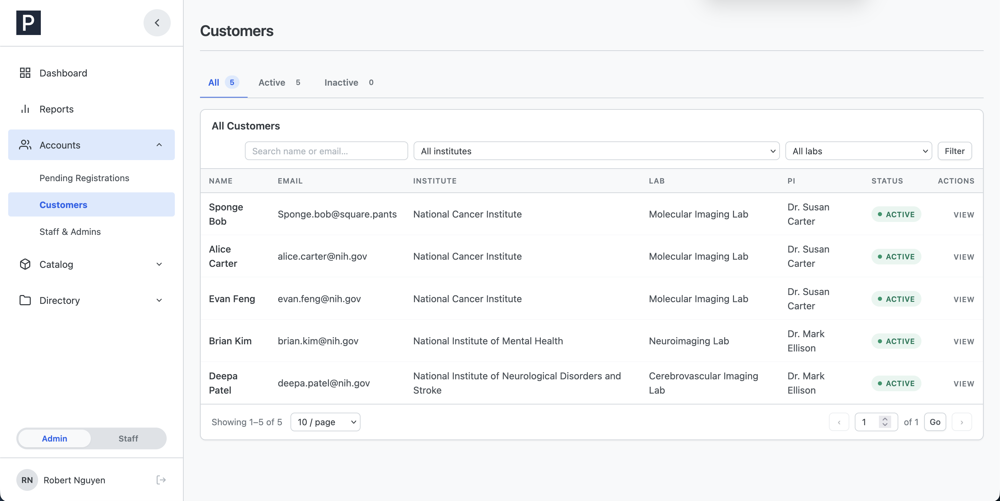
*Filter customers by name or email, institute, lab, and Active/Inactive status.*

Click **View** on a customer to open their page:

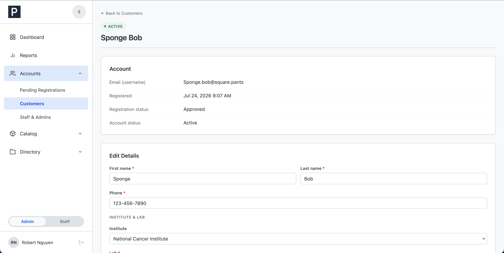
*A customer's page: account info, editable details, and account actions.*

**Editing details** — you can change their name, phone, institute, lab,
and supervising PI (customers can't edit any of this themselves). One
rule to know about lab and PI changes:

- **Keeping the current lab and PI always saves** — even if that lab or
  PI has since been deactivated, a name or phone edit is never blocked
  by it.
- **Changing to a different lab or PI** requires the new choice to be
  **active**, and the lab and PI must be **paired** (the PI is on that
  lab's roster — section 7). Inactive entries are marked "(inactive)" in
  the dropdowns.

**Deactivate Customer** signs them out immediately and blocks future
logins. Their order history stays fully intact and visible — nothing is
hidden or cancelled. **Reactivate Customer** restores access.

**Reset Password** generates a new temporary password (their current
password stops working immediately, and any lockout is cleared):

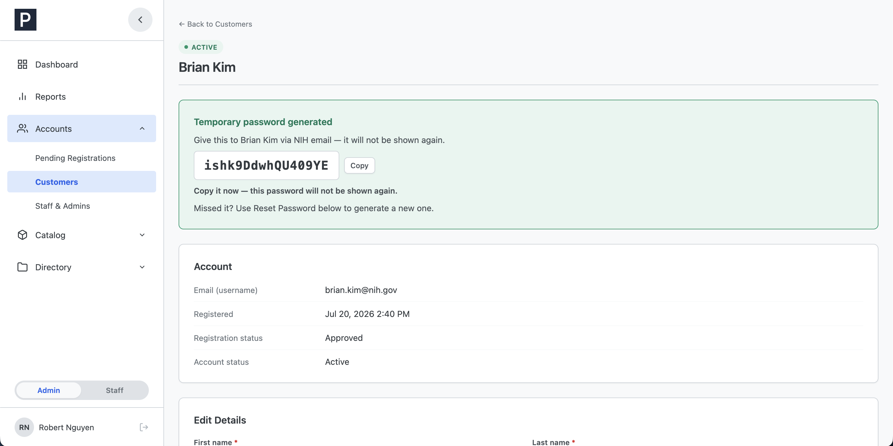
*Like approval passwords, a reset password is shown once, for a short time — copy it right away and relay it via NIH email.*

The banner is deliberately short-lived: it appears once and expires
after about a minute. If you miss it, just run Reset Password again.
Admins never see or choose a user's actual password — only these
one-time temporary ones.

## 4. Managing staff and admin accounts

**Accounts** lists all staff and admin accounts, filterable by role and
status.

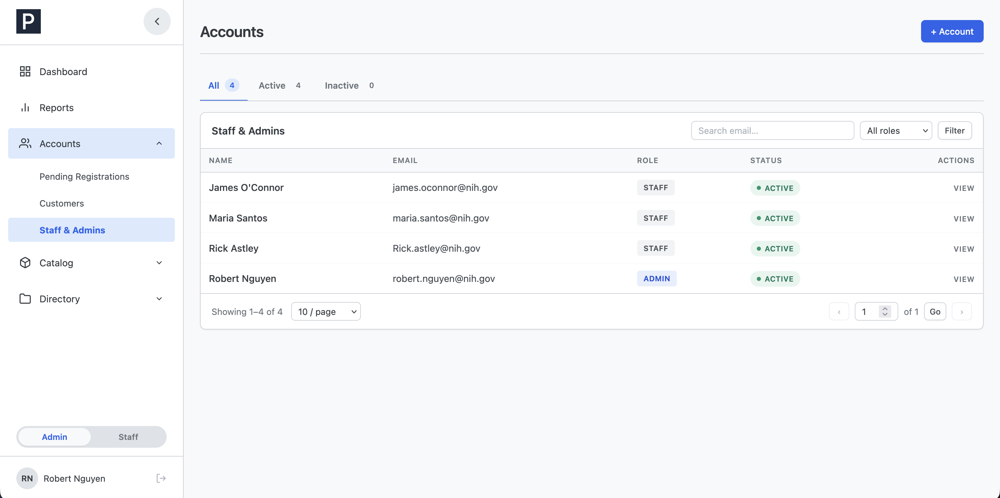
*Staff and admin accounts in one list.*

**To create an account:** click **+ Account**.

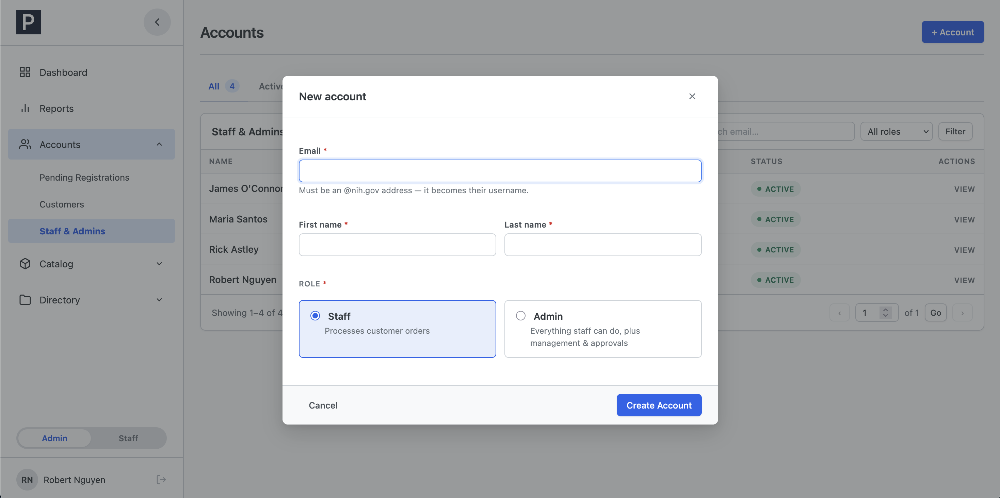
*Creating an account: the @nih.gov email becomes the username; pick Staff or Admin.*

Enter their **@nih.gov email** (this becomes their username), first and
last name, and choose the role: **Staff** (processes customer orders) or
**Admin** (everything staff can do, plus management and approvals).
Click **Create Account** — a one-time temporary password banner appears,
same rules as always: copy it now, relay via NIH email, it forces a
password change at first login.

**On an account's page** you can edit their name, and use the account
actions:

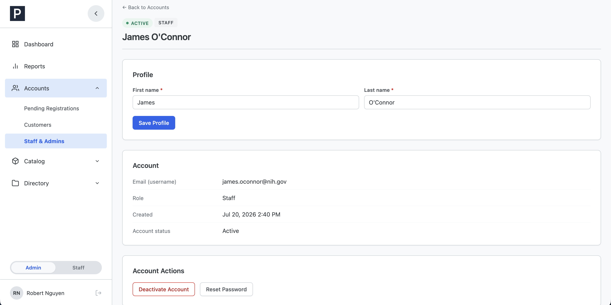
*An account's page. Note the safeguards on your own account.*

- **Deactivate Account** — signs them out immediately and blocks logins;
  **Reactivate** restores access. Two safeguards: you **cannot
  deactivate your own account**, and you **cannot deactivate the last
  active admin** — the system refuses, so there is always at least one
  admin who can get in.
- **Reset Password** — same one-time temporary password flow as for
  customers. You can't reset your **own** password here — use Change
  Password like everyone else.

## 5. Catalog: nuclides

The catalog is two levels: **nuclides**, and the **products** made from
them. Customers always pick a nuclide first, then a product — so the
nuclide list is the top of the ordering funnel.

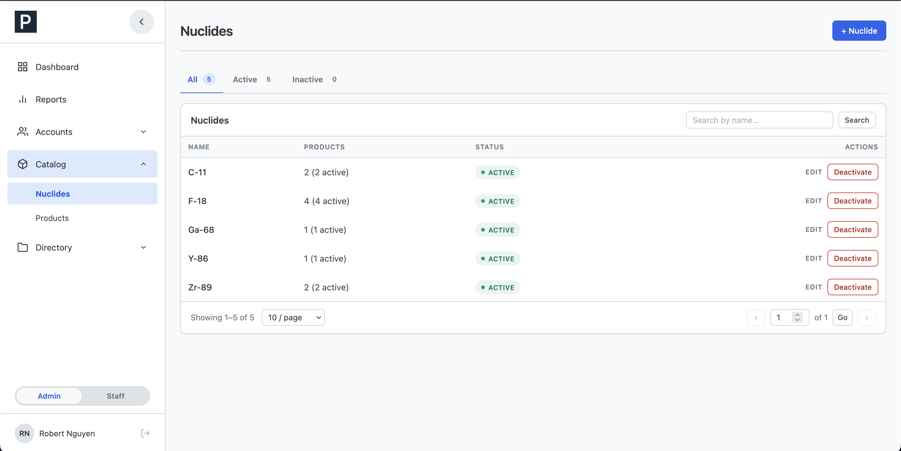
*Each nuclide shows how many products it has and whether it's active.*

- **Add:** click **+ Nuclide**, enter the name, and save.
- **Rename:** always allowed, any time — renaming updates how the
  nuclide displays everywhere, **including on past orders** (it's a
  label correction, not a new nuclide).

  
  *Renaming a nuclide.*

- **Deactivate:** takes the nuclide — **and every one of its products**
  — off the new-order form until you reactivate it. The confirmation
  spells out how many active products are affected. Past orders are
  untouched. Reactivating makes its active products orderable again
  automatically.

## 6. Catalog: products

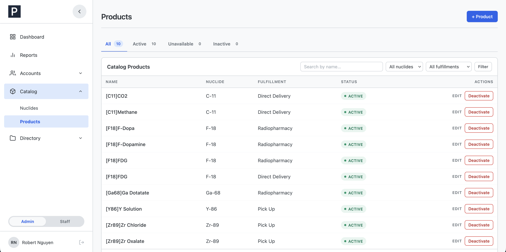
*Products, each tied to one nuclide and one fulfillment method.*

Every product belongs to **one nuclide** and has **one fulfillment
method** — Radiopharmacy, Pick Up, or Direct Delivery. Fulfillment is a
fixed property of the product, never chosen per-order. To offer the same
product a second way, **add a second product row** with the other
fulfillment — the add form's hint says exactly this, and customers will
see the two options side by side when ordering.

- **Add:** click **+ Product**; pick the nuclide (active nuclides only),
  name the product, choose the fulfillment.
- **Statuses in the list:** **Active** (orderable), **Inactive** (turned
  off), and **Unavailable** — meaning the product itself is active but
  its **nuclide** is deactivated, so customers can't order it until the
  nuclide comes back. That's your cue to check the nuclide, not the
  product.
- **Editing — the in-use lock:** once any order references a product,
  its **nuclide and fulfillment can no longer be changed** (the fields
  lock, and the form tells you why). This protects order history. The
  correct move is: **create a new product** with the right nuclide/
  fulfillment, then **deactivate the old one**. The product's *name*
  can always be edited.

  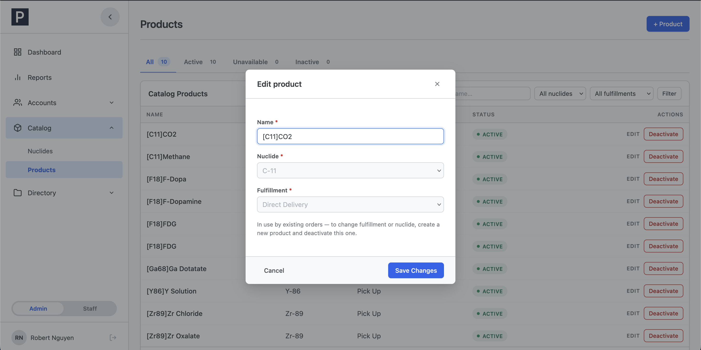
  *A product that's in use by orders: name is editable, nuclide and fulfillment are locked.*

- **Deactivate / Activate:** removes/restores the product on the
  new-order form. Activating a product whose nuclide is inactive is
  allowed, but the confirmation warns it will stay Unavailable until the
  nuclide is reactivated.

## 7. Directory: institutes, labs, and PIs

The directory drives **registration**: applicants pick their institute,
then a lab at that institute, then a PI on that lab's roster. The
`active` switches here control **only what new registrants (and
reassignments) can choose** — existing customers, their orders, and
their lab data are never affected by deactivating anything.

**Institutes:**

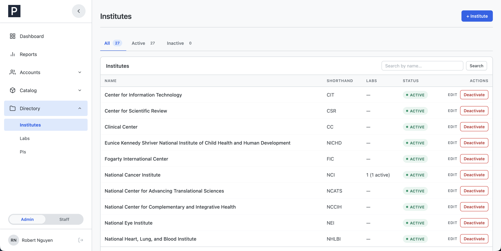
*Institutes, with optional shorthand (e.g. "NCI") and their lab counts.*

Add with **+ Institute** (name required, shorthand optional). Renaming
is always allowed and updates the display everywhere, including past
orders. Deactivating an institute makes **all of its labs**
unselectable for new registrations until it's reactivated (the
confirmation states the count).

**Labs:**

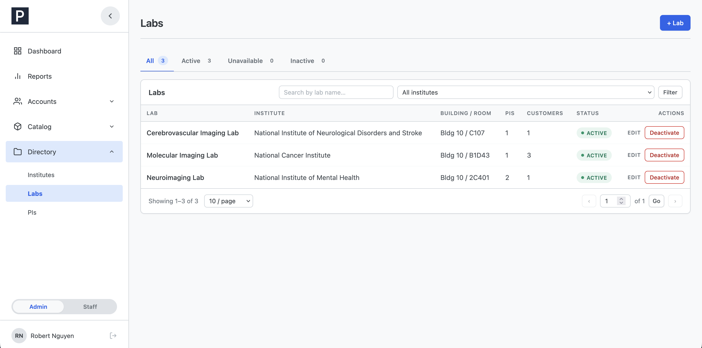
*Labs, each belonging to one institute. The Unavailable status means the lab is active but its institute isn't.*

Add with **+ Lab**: pick the institute (active ones only), name the lab,
optionally add building/room — and set up its **PI roster**. The roster
is the important part:

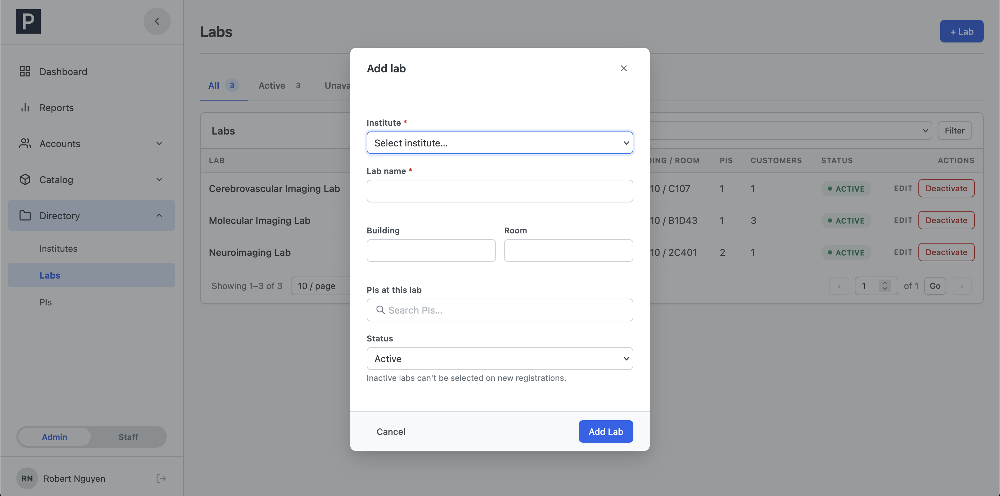
*The lab's PI roster — this is the only place lab↔PI pairing is managed.*

- **This is the only place PIs are attached to labs.** The PIs page has
  no pairing controls — to put a PI at a lab, edit that lab's roster.
- The roster is searchable; add PIs as chips, remove with the ×. When
  editing, each PI shows how many customers they supervise at this lab.
- Removing a PI from the roster does **not** affect the customers they
  already supervise — it only stops new registrants from choosing that
  pairing.

Deactivating a lab blocks it for new registrations; its existing
customers, orders, delivery locations, and product users are unaffected
(the confirmation says so). Like products, a lab shows **Unavailable**
when it's active but its institute isn't.

**PIs:**

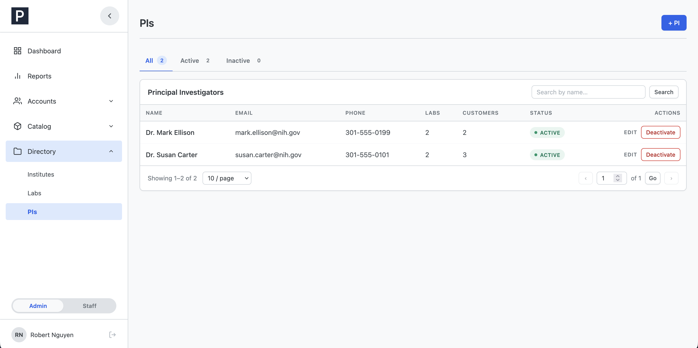
*PIs, with their lab and customer counts. Pairing to labs happens on the Labs page.*

Add with **+ PI** (name required; email and phone optional). Deactivating
a PI removes them from new-registration choices; the customers they
already supervise are unaffected.

## 8. Reports and CSV export

**Reports** exports order data as a CSV file for use in Excel or
elsewhere.

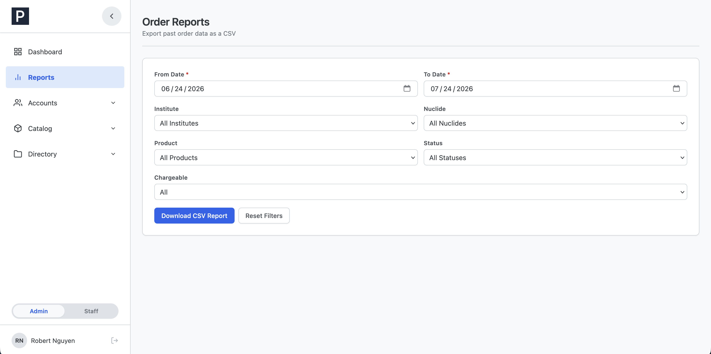
*The report form: date range is required, everything else is optional narrowing.*

1. Set **From Date** and **To Date** (both required — the range covers
   when orders were *placed*).
2. Optionally narrow by **Institute**, **Nuclide**, **Product**,
   **Status**, or **Chargeable** (Yes/No).
3. Click **Download CSV Report**. Your browser downloads a file named
   like `pet_orders_report_2026-07-23.csv`.

The CSV has one row per order with these columns: **Order ID, Order Date
(Y/M/D), Institute, Nuclide, Product, Status, Chargeable, Cancellation
Reason**. **Reset Filters** clears the form.
